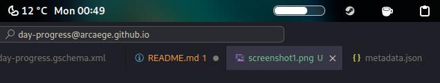

# Day Progress

A simple GNOME shell extension that displays a (somewhat) customisable progress bar of your day in the top panel to help you track your time. Mostly inspired by this MacOS app: https://www.producthunt.com/posts/day-progress 

## Screenshots

### Default

### Rounded

### Settings

