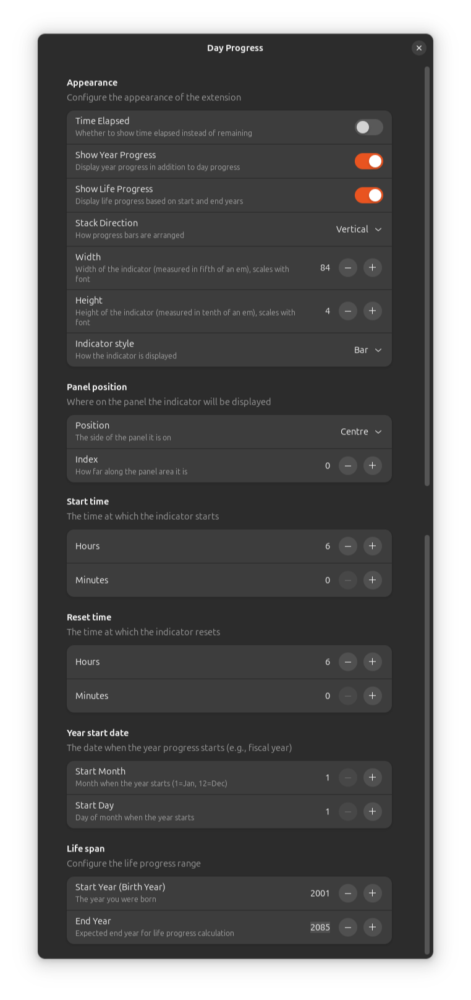

# Day Progress

A simple GNOME shell extension that displays a (somewhat) customisable progress bar of your day in the top panel to help you track your time. Mostly inspired by this MacOS app: [https://www.producthunt.com/posts/day-progress](https://www.producthunt.com/posts/day-progress)

## Reporting bugs/feature requests

Firstly, have look at [this](https://github.com/users/ArcaEge/projects/1/views/1) page to see if we're already working on it. If not, please submit an issue [here](https://github.com/ArcaEge/day-progress/issues/new), we'll have a look at it soon™️.

## Screenshots

### Default

### Rounded

### Settings

